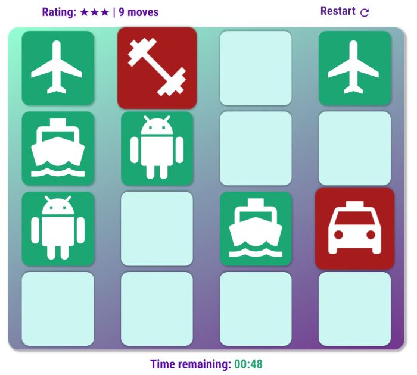

# Material Icons Memory Game
"Material Icon Memory Game"

## About this project
This project was created based on [Udacity](https://www.udacity.com/)'s **Front End Developer Nanodegree** Memory Game project.
Course [here](https://www.udacity.com/course/front-end-web-developer-nanodegree--nd001)
Course Syllabus [here](https://d20vrrgs8k4bvw.cloudfront.net/documents/en-US/fend-syllabus-9.0.0.pdf).

This version was made from scratch, using HTML, CSS and Vanilla Javascript only. No frameworks and/or build tools were used.
The project was done with no *Graceful degradation* in mind. Test only on newer browsers.

***

### How to play
*Playable Version Available* [here](https://betocostadev.github.io/apps/memgame/index.html).

**Game Rules**
Game starts as soons as you click play:
- The play will have 5 seconds to see how the cards were place and try to memorize it;
- Cards will be fliped and the player will only see the back side of each card;
 - Clicking on any card will flip it. Then:
   - The game will wait for the player to click on a next card;
   - By clicking on a second card the game will add a move count and will check if:
   - The cards are the same:
     - If they are, both cards will stay front-faced;
     - If they aren't, both cards will be fliped again and a move is counted;
- By clicking on all the correct pairs will finish the game and show a user score.
- If the player takes 1m 15s to complete the game, the time is up and the game is lost.

***

### Usage
**Feel Free** to fork this project and change it.
The code definitely needs some refactoring😥. Mainly for the *time, check and compare cards* functions.

The code is full of relevant comments, it will help new developers.

#### Dependencies
**None:** This project was created using HTML5, CSS3 and ES6 only.

#### Tasks
- ✅ Base HTML
- ✅ Base CSS
- ✅ Base JS Functions
- ✅ Responsiveness
- 🔲 Social Media Sharing

***

#### Browser Testing
- ✅ Chrome for Desktop
- ✅ Chrome for Android
- ✅ Firefox Quantum Developer Edition
- ✅ Microsoft Edge
- 🔲 Safari for iOS 👵
- 🔲 Safari for Mac 👴

***

### Resources
##### To build the project
- [Udacity](https://www.udacity.com/) as a base project for the Nanodegree ❤️
- [Google Fonts](https://fonts.google.com/) - Roboto Condensed font ⭐️⭐️
- [Material Icons](https://material.io/tools/icons/?style=baseline) - Icons ⭐️⭐️
- [Free Sound](https://freesound.org/) - Sounds ⭐️
- [eslint](https://eslint.org/) - Way better JS programming ⭐️⭐️
- [Dillinger](https://dillinger.io/) - To write the Readme ❤️

##### Learning Resources
- Udacity's Front End Developer Nanodegree - [here](https://www.udacity.com/course/front-end-web-developer-nanodegree--nd001)
- [MDN](https://developer.mozilla.org/en-US/docs/Web/API/Element)- DOM Elements
- [MDN](https://developer.mozilla.org/en-US/docs/Web/API/Document) - DOM Selectors
- [MDN](https://developer.mozilla.org/bm/docs/Web/JavaScript/Reference/Global_Objects/Array) - JS Array Methods
- [MDN](https://developer.mozilla.org/en-US/docs/Web/JavaScript/Reference/Global_Objects/String) - JS String Methods
- [MDN](https://developer.mozilla.org/en-US/docs/Web/JavaScript/Reference/Operators/Conditional_Operator) - JS Conditional (ternary) Operator 👍
- [w3schools](https://www.w3schools.com/css/css3_2dtransforms.asp) - To refresh my memory on CSS transformations 😄
- [Github Markdown Cheatsheet](https://help.github.com/en/articles/basic-writing-and-formatting-syntax#headings) - To remember how to write this 😄

---

### Creation
Designed using [Figma](https://www.figma.com/).
Icon SVGs from [Material Design Icons](https://material.io/tools/icons/?style=baseline).
Developed on [Visual Studio Code](https://code.visualstudio.com/).

**LICENSE:** **[MIT](https://tldrlegal.com/license/mit-license)**