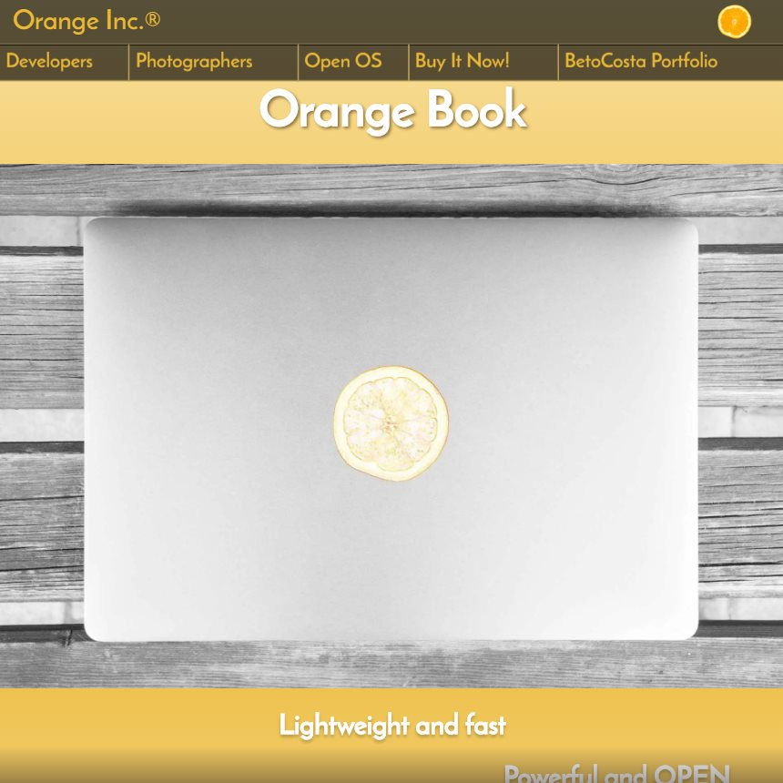

# Orange Book | Product Landing Page
"Orange Book Landing Page"

## About this project
Project build as the one of the projects of the [Responsive Web Design Certification](https://learn.freecodecamp.org/responsive-web-design/responsive-web-design-projects/build-a-product-landing-page) from [freeCodeCamp](https://www.freecodecamp.org/)
It was build using only HTML, CSS and vanilla JavaScript.
Besides the SASS preprocessor and Gulp for a better build management, no frameworks were used.

The project was build with no *Graceful degradation* in mind. Tested only on newer browsers.

***

### Screen Sizes
Build with Mobile Thinking first.
Tested from **320px** to **1920px**.

***

### Usage
**Feel Free** to fork this project and change it.

#### Dev Dependencies
* "browser-sync": "^2.26.3",
* "gulp": "^4.0.0",
* "gulp-concat": "^2.6.1",
* "gulp-imagemin": "^5.0.3",
* "gulp-sass": "^4.0.2",
* "gulp-sourcemaps": "^2.6.5",
* "gulp-webp": "^4.0.1",
* "node-sass": "^4.11.0"

#### Tasks
- ✅ Gulp for a better build
- ✅ Base HTML
- ✅ Base CSS
- ✅ Base JS Functions
- ✅ Responsiveness

***

#### Browser Testing
- ✅ Chrome for Desktop
- ✅ Chrome for Android
- ✅ Firefox Quantum Developer Edition
- ✅ Microsoft Edge
- ✅ Safari for iOS 👵

***

### Resources
##### To build the project
- [freeCodeCamp](https://www.freecodecamp.org/) as my learning material ❤️
- [Google Fonts](https://fonts.google.com/) - Reem Kufi and Roboto fonts ⭐️⭐️
- [Material Icons](https://material.io/tools/icons/?style=baseline) - Icons ⭐️⭐️
- [Pop OS! Icons](https://github.com/pop-os/icon-theme) - Software Icons ❤️
- [eslint](https://eslint.org/) - Way better JS programming ⭐️⭐️
- [Dillinger](https://dillinger.io/) - To write the Readme ❤️

##### Learning Resources
- freeCodeCamp - [Responsive Web Design](https://learn.freecodecamp.org/)
- [MDN](https://developer.mozilla.org/en-US/docs/Web/API/Element)- DOM Elements
- [MDN](https://developer.mozilla.org/en-US/docs/Web/API/Document) - DOM Selectors

---

### Creation
Designed using [Figma](https://www.figma.com/).
Developed on [Visual Studio Code](https://code.visualstudio.com/).

**LICENSE:** **[MIT](https://tldrlegal.com/license/mit-license)**
<!--stackedit_data:
eyJoaXN0b3J5IjpbLTQ5NDQ1MDMyMl19
-->